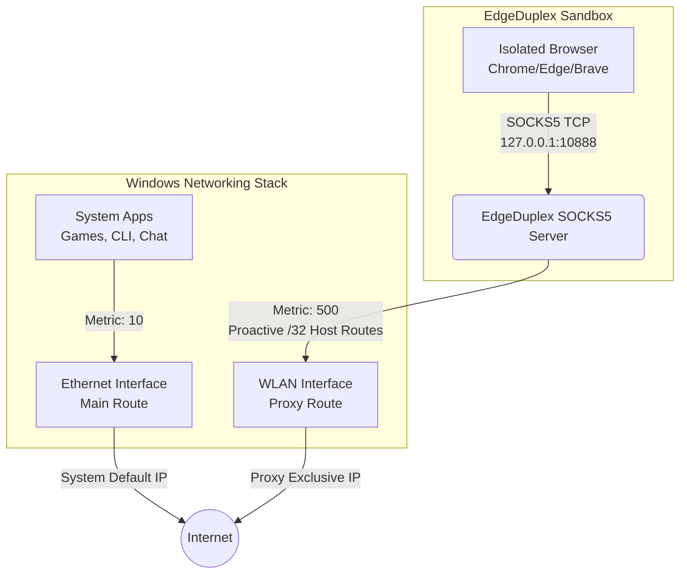

# EdgeDuplex

EdgeDuplex is an advanced, lightweight networking tool for Windows that enables a true "Edge duplex mode" utilizing dual network interfaces simultaneously, allowing complete application-level network isolation without the need for virtual network adapters or third-party VPN drivers.

By default, it allows your **system default traffic** (CLI, Games, Discord) to keep using Ethernet via manipulated Windows Interface Metrics, while simultaneously isolating your **default Chromium browser** (Edge, Chrome, Brave) into a local SOCKS5 proxy sandbox. The proxy proactively injects `/32` Host Routes into your routing table to force the browser's traffic exclusively over your secondary interface (WLAN / Wi-Fi).

**⚠️ Warning:** Use only with networks you are authorized to use.

## 🕸️ Network Topology



## ✨ Features

- **Dual Network Isolation:** Keep Ethernet as the primary connection while routing specific traffic via Wi-Fi via aggressive OS-level Host Routes.
- **Fast Routing (Zero-Delay):** Dynamically injects native `route add` commands to bypass the Windows Strong Host Model in milliseconds, avoiding DNS resolution timeouts.
- **Chromium Ecosystem Support:** Automatically detects your default browser (Chrome, Brave, or Edge) and intelligently manages its isolated lifecycle (tasklist polling).
- **Reverse Mode:** Reverse the roles via configuration: make WLAN the system default and route your browser traffic via Ethernet.
- **Clean Shutdown:** Continuously polls browser existence. When all isolated browser windows are closed, EdgeDuplex safely reverts all network modifications instantly.
- **Silent & Elevated:** Distributed as a native `.exe` with UAC requests built-in and invisible background execution.

## 📂 Project Structure

```text
EdgeDuplex/
├── edge_duplex/
│   ├── cli.py            # Headless entry point & process management
│   ├── config.py         # JSON state and configuration parsing
│   ├── edge.py           # Chromium browser detection and lifecycle
│   ├── gui.py            # Tkinter graphic user interface
│   ├── i18n.py           # i18n Translation dictionaries (en/zh)
│   ├── proxy.py          # Asynchronous SOCKS5 interceptor
│   ├── routing.py        # PowerShell / Native route manipulation
│   └── state.py          # Runtime temporary state and locks
├── run.py                # Main executable entry point
├── CHANGELOG.md          # Version history
├── README.md             # Documentation (this file)
└── LICENSE               # MIT License
```

## ⚙️ Configuration (config.json)

The first time you run EdgeDuplex, a `config.json` file will be generated in the application directory. You can edit this file to customize the behavior:

```json
{
    "language": "zh",
    "reverse_mode": false,
    "dns": "1.1.1.1",
    "port": 10888
}
```

- **`language`**: Set to `"zh"` for Chinese or `"en"` for English. (Can also be toggled in the GUI).
- **`reverse_mode`**: Set to `true` to reverse the logic (Proxy via Ethernet, system default on WLAN).
- **`dns`**: Custom DoH / DNS server for proxy resolution (e.g., `1.1.1.1` or `8.8.8.8`).
- **`port`**: The local SOCKS5 port to bind.

## 🛠️ Requirements

- **OS:** Windows 10/11
- **Python:** 3.10+ (if running from source)
- **Privileges:** Administrator rights (required for modifying network metrics and routes)

## 🚀 Usage

### Running from Release (Recommended)

1. Download the latest `edge_duplex.exe` from the [Releases](https://github.com/yuxiao1231/EdgeDuplex/releases) page.
2. Double-click the `.exe`. It will automatically prompt for UAC Administrator privileges.
3. Use the GUI to start the proxy. The tool will automatically close your existing browser sessions to isolate them and re-launch your browser into the sandbox.
4. When finished, simply close your browser window. EdgeDuplex will detect the exit and restore your system network.

### Running from source

1. Ensure you have Python installed.
2. Clone this repository.
3. Open an elevated terminal (Run as Administrator) and execute:
   ```bash
   python run.py
   ```

## 📦 Automated Release

This project uses GitHub Actions to automatically package `run.py` into a standalone Windows executable (`edge_duplex.exe`). 
Whenever a push to the `main` branch occurs, the workflow extracts the latest entry from `CHANGELOG.md`, builds the executable via PyInstaller, and creates a formatted release on GitHub.

## 📜 License

This project is licensed under the MIT License - see the [LICENSE](LICENSE) file for details.